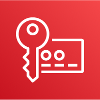
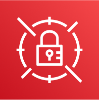
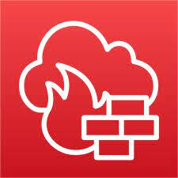
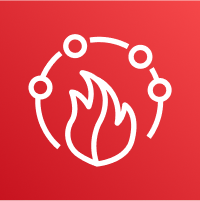
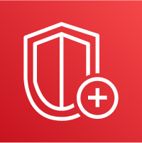
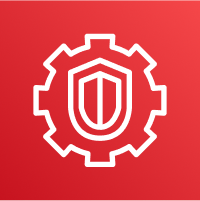

# AWS_SAA_C03(10) / Security & Encryption

# KMS

Key Management Service의 약자.

데이터 암호화키를 생성하고 키 관리, 암호화, 복호화를 수행하는 서비스.

- 대부분의 AWS 서비스와 통합된다.

- IAM과 완전히 통합됨.

## Automatic Key Rotation

AWS관리형 혹은 고객 관리형 KMS 키를 1년마다 자동으로 교체할 수 있다. imported KMS Key는 수동 교체만 가능하다.

## Multi-Region Keys

- Primary-Region에 있는 Key를 Multi-Region에 복사할 수 있다.

- 한 지역에서 암호화 하고 다른 지역에서 복호화 할 수 있다.

- 각 다중 지역 키는 독립적으로 관리된다. (전역 서비스 x, 기본 키 + 복제본 구조)

# Secrets Manager

AWS에서 제공하는 비밀 저장 서비스.

- X일 마다 교체하는 rotation기능 제공.

- Lambda를 사용하여 암호를 rotation시 자동으로 생성 가능하다.

- RDS와 주로 통합되며 비밀키는 KMS를 통해 암호화 된다.

## Multi-Region Secrets

- 다중 리전에 Secrets를 복제한다.

- Primary-Secrets와 Replicas는 계속해서 동기화된다.

- Replica를 독립해서 승격시킬 수 있다.

# ACM

AWS Certificate Manager의 약자로 AWS에서 제공하는 인증서 관리 서비스.

- TLS 인증서를 관리하여 HTTPS 암호화를 제공한다.

- public 및 private TLS 암호화를 지원한다. (public은 무료)

- Elactic Load Balancer와 통합.

- EC2와 함께 사용할 수 없다.

- 외부 Certificate Authority (CA)는 자동으로 Rotate할 수 없다.

# Network Firewall

VPC에서 사용자 지정 방화벽 규칙을 만들어 트래픽 검사와 필터링을 수행할 수 있는 서비스.

- VPC에 들어가기 이전에 트래픽을 필터링 한다.

- 트래픽 흐름 제어.

- 트래픽 검사 및 필터링.

# WAF

Web Application Firewall의 약자로 HTTP트래픽을 필터링 하여 웹 어플리케이션을 보호한다.

- ALB, API gateway, CloudFront, AppSync GraphQL API, Cognito User Pool과 통합된다.

- Web Access Control List (ACL) 규칙을 정의한다.

- SQL injection 및 Cross-Site Scripting (XSS) 같은 공격으로 부터 보호한다.

- Rate-base로 DDoS를 보호한다.

- Web ACL은 CloudFront를 제외하고 Regional하다.

- Layer7(Network Layer)에서 동작.

# Shield

DDoS 방어 서비스.

- CloudFront, ELB, Route53 등과 함께 쓰인다.

- 제3자 DNS 서비스와 통합할 수 있다.

- Layer3(Network), Layer4(Transport), Layer7(Network Layer)에서 동작.

## Shield Standard

- 모든 AWS 활성 사용자에게 무료로 제공된다.

- Layer 3, 4 DDoS 공격을 탐지 및 방어한다.

- SYN/UDP Floods, Reflection attacks등에 대한 방어를 제공한다.

## Shield Advanced

- 최적화된 DDoS 완화 서비스.

- Layer 7 DDoS 공격을 탐지 및 방어한다.

- Organization 당 월 $3000

- AWS DDoS response team (DRP)에 24시간 엑세스 가능.

# Firewall Manager

공통 보안 정책 관리 서비스.

- AWS 조직의 모든 계정에서 적용될 규칙을 관리합니다.

- Application Load Balancer, API 게이트웨이, CloudFront에 대한 WAF 규칙 설정.

- ALB, CLB, NLB, Elastic IP, CloudFront에 대한 AWS Shield Advanced규칙 설정.

- EC2, Application Load Balancer, ENI resources in VPC에 대한 Security Groups관리.

- VPC Level에서의 AWS Network Firewall관리.

- 규칙은 조직의 모든 계정과 향후 계정에 걸쳐 생성되는 새 리소스에 적용된다.

# GuardDuty

AWS 계정을 보호하기 위한 지능형 위협 탐지 서비스.

- 머신러닝, 이상 탐지, 제3자 데이터를 사용한다.

- AWS 계정 내에서 이루어지는 모든 활동을 분석해서 위협을 탐지할 수 있다.

- 직접적 트래픽 흐름 제어를 제공하지는 않는다.

# Inspector

자동화된 보안 평가 서비스.

- 어플리케이션의 보안 취약점을 식별하고 지속적으로 검사한다.

- EC2, ECR, Lambda에 대해서 보안 평가를 수행한다.

- S3 등과 같은 AWS 리소스 모니터링에는 부적합하다.

# Macie

머신러닝과 패턴 일치를 사용해 중요 데이터를 보호하는 완전 관리형 서비스.

- S3 등에 저장된 개인 식별 정보(PII)와 같은 데이터를 식별하고 경고하는데 도움을 준다.
