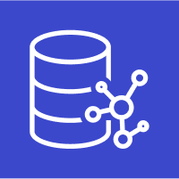

# AWS SAA C03 / Data Storage

# RDS


Relational Database Service의 약자로 AWS가 관리하는 관계형 데이터 베이스이다.

- 자동화된 프로비저닝, OS 패치를 제공한다.

- 지속적으로 백업하며, 특정 시간으로 복원이 가능하다.

- 읽기 성능 향상을 위한 복제본 생성이 가능하다.

- 다중 AZ 설정이 가능하다.

- EBS의 위에서 동작한다.

- SSH 접속이 불가능하다.

- Secrets Manager와 통합하여 DB 자격 증명을 관리할 수 있다.

## Read Replicas

- 최대 15개의 읽기 전용 복제본을 가질 수 있다.

- 단일 AZ, 교차 AZ 모두 가능하다.

- 비동기적으로 Eventual Consistency를 달성한다.

- 복제본을 그냥 DB로 승격시킬 수 있다.

- 데이터가 한 AZ에서 다른 AZ로 이동할 때 네트워크 비용이 발생한다. (동일 지역인 경우 발생하지 않음)

## Multi AZ

- 다른 AZ에 있는 standby RDS로 정보를 동기적으로 복제한다.

- 하나의 AZ에 문제가 생기거나, 네트워크가 사라진 경우 장애극복 용도로 사용된다.

- 하나의 DNS name으로 접근 가능하다.

- downtime이 0이다. (DB를 멈출 필요가 없다)

- 스냅샷이 생긴다 -> 다른 AZ에 스냅샷을 복구한다 -> 동기화가 이루어진다.

## RDS Proxy

완전 관리형 데이터베이스 프록시이다.

- app이 connection을 공유하도록 한다.

- database 자원을 덜 소모하게 만들어 효율성을 늘리고 부하를 줄인다.

- RDS와 Aurora의 장애 극복 시간을 66% 까지 줄일 수 있다.

- DB에 IAM인증을 강제할 수 있다.

- RDS Proxy는 공개적으로 접근할 수 없다.

# Aurora


AWS의 독점 기술로, 클라우드에 최적화된 RDB의 일종이다.

- Postgres 및 MySQL을 지원한다.

- RDS의 MySQL보다 5배, Postgres보다 3배 이상 향상된 성능을 제공한다.

- Aurora 스토리지는 10GB 단위로 최대 128TB까지 자동으로 증가한다.

- 즉각적 장애 극복 조치를 지원한다 (30초 이내로 장애 극복).

- RDB보다 20% 가량 비용이 더 높다.

- master와 최대 15개의 읽기 전용 복제본을 생성 가능하다.

- Cross Region 복제를 지원한다.

- 3개의 AZ에 걸쳐 6개의 복제본에 저장된다.

## Aurora Replicas

- Write Endpoint와 ReadEndpoint를 통해 읽기와 쓰기를 수행하며, 자동으로 스케일링 된다.

- Custom Endpoints를 통해 특정 Aurora instance들로 접근을 유도할 수 있다.

## Aurora Multi-Master

- 지속적인 쓰기에 대한 failover가 필요할 때 사용한다.

## Aurora Serverless

- 실제 사용량을 기반으로 자동으로 확장된다.

- 간헐적 워크로드에 적합하다.

## Global Aurora

- 기본 지역 1개와 보조 지역 5개를 선택할 수 있고, 보조 지역당 읽기 복제본 최대 16개를 가질 수 있다.

- 재해 복구를 위해 사용된다.

# DynamoDB


완전 관리형 NoSQL 데이터베이스.

- Provisioned Mode(default): 초당 읽기, 쓰기 수를 명시할 수 있다. auto-scaling mode를 더할 수 있다.

- On-Demand mode: Read/Write는 부하에 따라 자동으로 증감한다. 예측이 불가능할 때 좋다.

- TTL 기능과 결합하여 session 저장소로 사용할 수 있다.

- DynamoDB와 호환 되는 DAX cluster를 read cache로 사용할 수 있다. microsecond read latency를 가짐. (DynamoDB Accelerator)

- 보안, 인증, 인가 모두 IAM을 통해 이루어짐.

- DynamoDB Streams로 테이블의 변경사항에 대한 이벤트를 처리할 수 있다.

- Global Table로 active-active 향태의 다중 리전 설정을 할 수 있다.

- 빠르게 변하는, 유연한 스키마에 적합하다.

# DocumentDB


완전 관리형 MongoDB 대체 서비스.

- 3개의 Multi-AZ, Read Replica 지원

- 10GB 단위로 자동으로 확장.

# ElastiCache


관리형 Redis 또는 Memcached이다.

- MongoDB와 동일하다.

- 캐시는 뛰어난 성능의 인메모리 데이터베이스이다.

- 읽기에 대한 데이터베이스의 부하를 줄인다.

- 어플리케이션을 stateless로 만드는데 도움이 된다.

# Neptune



완전 관리형 그래프 데이터베이스.

- 소셜 네트워크와 같이 연결성이 높은 데이터셋을 사용하는 어플리케이션에 적합.

- 그래프 데이터 셋에서 복잡한 쿼리를 실행하는 것에 적합.

# Keyspaces (for Apache Cassandra)


관리형 Apache Cassandra 기반의 NoSQL 데이터베이스.

- 서버리스.

- 자동 스케일링.

- 3개의 AZ에 걸쳐 복제됨.

- Cassandra Query Language (CQL)을 사용한다.

- On-demand mode와 provisioned mode가 있다.

# QLDB


Quantum Ledger Database의 약자로 금융 트랜잭션 원장을 기록하는 데이터베이스.

- 완전 관리형 서버리스 데이터베이스.

- 데이터의 시간에 따른 모든 변경을 검토하는데 사용된다.

- 불변 시스템. (한번 쓰이면 지울 수 없음)

- SQL을 문법 지원.

- 분산의 개념이 없고 중앙 데이터베이스에서만 저널을 작성할 수 있다. (no decentralization compoenent)

# Timestream


완전 관리형 서버리스 시계열 데이터베이스.

- 시계열: 시간 정보를 포함하는 포인트의 모음.

- 자동 스케일링.

- RDB보다 빠르고 저렴.

- 최근 데이터는 메모리에 보관되고 과거 데이터는 비용 최적화 스토리지에 보관.

- 시계열 분석 기능이 내장되어 있음.

- 전송중 및 저장 중 암호화 된다.

# S3


S3는 Simple Storage Service의 약자로, 객체 스토리지 서비스이다.

- S3는 무한대로 데이터를 저장할 수 있고, 자동으로 확장되기 때문에 사용자는 저장 공간에 대해서 신경 쓰지 않아도 된다.

- S3는 데이터를 여러 가용 영역에 걸쳐 저장히기 때문에 높은 내구성과 가용성을 보장한다.

- S3는 라이프사이클 정책, 버전 관리, 태깅 등의 기능을 통해 복잡한 데이터 세트를 효과적으로 관리할 수 있다.

- S3는 사용한 만큼 비용을 지불한다. Glacier 등을 이용하여 비용을 절감할 수 있다.

## Buckets

S3는 bucket(derectories)를 통해 객체를 저장한다.

- globally unique해야 한다.

- global service가 아니고 region에 속한다.

## Objects

Objects는 저장되는 파일이다.

- Obejct(files)는 key를 가지며, key는 파일의 경로이다.

- 최대 5TB 사이즈이다.

- Metadata, Tags, Version ID를 갖는다.

## Security

IAM permisson 혹은 Resource policy가 접근을 허용하고 명확한 Deny가 없다면 유저가 객체에 접근할 수 있다.

1. User-Based

   - IAM Policies: IAM을 통해 특정 사용자 또는 사용자 그룹에게 S3 버킷 또는 객체에 대한 액세스 권한을 부여할 수 있다.

   - Access Control Lists (ACLs): 사용자 또는 Predefined Groups에게 리소스에 대한 액세스를 제공하거나 거부할 수 있다.

   - Temporary Security Credentials: AWS Security Token Service를 통해 임시 권한을 부여할 수 있다.

2. Resource-Based

   - Bucket Policies: 버킷 수준에서 정책을 설정하여, 해당 버킷 내 모든 객체에 대한 액세스 권한을 관리할 수 있다. 버킷에 액세스할 수 있는 사용자와 그룹 등을 정의하고, 허용되는 액션과 조건을 지정한다.

   - Object Access Control Lists (ACLs): 각 객체에 대한 사용자별 권한을 설정하여 액세스를 세밀하게 제어할 수 있다. (Bucket Policies와 유사하지만 더 세밀함)

   - Block Public Access: 버킷 및 객체에 설정된 모든 공개 액세스 권한을 차단하는 강력한 관리 기능이다.

## Policies

JSON 기반의 S3 정책이다.

- Resource: 버킷 및 객체

- Effect: 허용 / 거부

- Action: 허용 또는 거부를 위한 API 집합

- Principal: 정책을 적용할 계정 또는 사용자

:: Principal이 Resource의 Action을 하는 것을 Effect(Allow/Deny)한다.

```JSON
{
  "Version": "2012-10-17",
  "Statement": [
    {
      "Effect": "Allow",
      "Principal": "*",
      "Action": "s3:GetObject",
      "Resource": "arn:aws:s3:::example-bucket/*",
      "Condition": {
        "StringEquals": {
          "aws:PrincipalOrgID": "o-1234567890"
        }
      }
    }
  ]
}
```

## S3 Standard – General Purpose

- 99.99% 가용성: 자주 접근되는 데이터를 위한 고성능 스토리지.
- 용도: 빅 데이터 분석, 모바일 및 게임 어플리케이션, 콘텐츠 배포 등.
- 특징: 낮은 지연 시간과 높은 처리량, 2개 시설의 동시적 장애를 견딜 수 있음.

## S3 Infrequent Access (IA)

1. S3 Standard-IA:

   - 99.9% 가용성: 비교적 자주 접근되지 않지만, 필요할 때 빠른 접근이 필요한 데이터용.

   - 비용: S3 Standard보다 낮음.

   - 용도: 재해 복구, 백업 등.

2. S3 One Zone-IA:

   - 단일 AZ에서 99.999999999% 내구성: 데이터는 하나의 가용 영역에 저장되며, 그 영역이 파괴되면 데이터가 손실될 수 있음.

   - 99.5% 가용성: 보조 백업 복사본 저장 또는 재생성 가능한 데이터 저장용.

## S3 Glacier Storage

저비용 보관/백업용 객체 스토리지.

- S3 Glacier Instant Retrieval: 분기별로 한 번 접근하는 데이터용, 밀리초 내 검색 가능.

- S3 Glacier Flexible Retrieval (구 S3 Glacier): 요청이 완료되는 시간에 따른 다양한 검색 옵션 제공.

- S3 Glacier Deep Archive: 장기 보관용, 12시간 또는 48시간 검색 옵션.

## S3 Intelligent-Tiering

- 자동 계층 이동: 사용량에 따라 객체를 자동으로 다른 액세스 계층으로 이동.

- 비용: 작은 월별 모니터링 및 자동 계층 이동 비용이 든다.

- 검색 비용 없음

- Frequent Access tier -> Infrequent Access tier -> Archive Instant Access tier -> Archive Access tier -> Deep Archive Access tier

## Performance

### S3 basics

- S3는 요청량이 많아지면 자동으로 확장하며, 100 ~ 200ms의 지연 시간을 갖는다.

- 버킷의 접두사 마다 초당 3500 ~ 5500개의 요청을 처리할 수 있다.

### Multi-Part Upload

- 업로드를 여러 부분으로 나눠 동시에 전송한다.

- 100MB 이상의 파일에 권장되며, 5GB 이상의 파일에는 필수적으로 사용해야 한다.

### Transfer Acceleration

- 파일을 AWS Edge Location으로 전송하고, 이 위치에서 데이터를 대상 지역의 S3 버킷으로 전달하여 전송 속도를 증가시킨다.

- 가장 가까운 Public 인터넷을 통해 Edge Location으로 전송하고 그 뒤 더 빠른 AWS 전용선으로 S3에 업로드 한다.

- Multi-Part Upload와 함께 사용할 수 있다.

## Byte-Range Fetches

GET 요청을 병렬화 하여 특정 범위의 바이트만 가져온다.

## S3 Select

server-side filtering과 SQL을 통해 보다 적은 데이터를 가져온다.

## Batch Operations

단일 요청으로 S3객체에 대한 대량 작업을 수행한다. 암호화 되지 않은 객체를 암호화 할 수 있다.

# Snow Family


AWS Snow Family는 물리적인 데이터 전송 솔루션의 모음이다.

# FSx


AWS가 제공하는 완전 관리형 파일 스토리지 서비스로, Windows 파일 서버와 Lustre 파일 시스템을 지원한다.

## FSx for Windows

완전 관리형 Windows 기반 파일 스토리지 서비스로, Microsoft Windows 서버의 네이티브 호환성과 기능을 제공한다.

## FSx for Lustre

완전 관리형 파일 시스템으로, 고성능 컴퓨팅 워크로드에 최적화 되어 있으다. 빠른 데이터 처리와 대규모 스토리지 작업을 지원한다.

## Storage Gateway


on-premises data와 cloud data 사이의 가교 역할을 하는 서비스.

구성된 S3 버킷은 NFS와 SMB protocol을 사용하여 액세스 할 수 있다.

# Transfer Family


FTP 프로토콜을 사용하여 Amazon S3 또는 Amazon EFS와의 파일 전송을 위한 완전 관리형 서비스.

- FTP 프로토콜 지원

- FTPS 프로토콜 지원 (File Transfer Protocol over SSL)

- SFTP 프로토콜 지원 (Secure File Transfer Protocol)

# DataSync


온프레미스 데이터 스토리지 및 기타 클라우드, AWS에서 AWS 클라우드로 데이터를 온라인으로 전송할 수 있는 서비스.

- S3, EFS, FSx로 동기화 가능.

- 복제 작업 cron 가능.

- 파일 권한 및 메타데이터가 보존된다.
