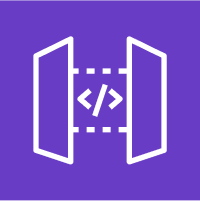
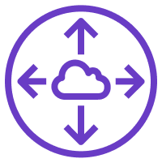
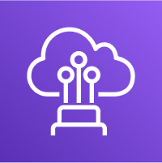
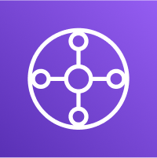

# AWS SAA C03 / Network

# Route53

AWS에서 제공하는 DNS(Domain Name System) 서비스.

- Authoritative DNS 서비스이다. (내가 직접 DNS 레코드를 업데이트 할 수 있음)

## Record Type

- A: hostname을 IPv4에 매핑 한다.

- AAAA: hostname을 IPv6에 매핑 한다.

- CNAME: hostname을 다른 hostname에 매핑 한다.

- Alias: hostname을 AWS 리소스에 매핑한다.

  - Target: ELB, ClourFront, API gateway, EB, S3 website, VPC interface endpoint, Global Accelerator, Route53 record.

- NS: 도메인에 대한 트래픽이 어떻게 라우팅될지를 제어하는 서버의 집합이다.

- CNAME vs Alias:

  - CNAME: NON-ROOT domain에만 사용 가능. EC2에 사용 가능.

  - Alias: ROOT domain에도 사용 가능. 무료. native health check 제공. EC2는 Alias를 설정할 수 없다.

## Hosted Zone

Public Hosted Zone: 인터넷에서의 트래픽에 응답할 수 있다.

Private Hosted Zone: 하나 혹은 그 이상의 VPCs에서 온 요청에 응답할 수 있다.

## Routing Policies

### Simple

기본 라우팅 정책으로, 단일 리소스에 대한 DNS 쿼리에 사용된다.

- 같은 record에 multi value 값으로 route53이 응답하면 client에서 하나를 임의로 선택한다.

- Alias와 함께 사용되면 하나의 AWS 리소스만을 대상으로 지정할 수 있다.

- Health check와 연동할 수 없다.

### Weighted

서로 다른 리소스로 트래픽을 가중치에 따라 분산시키는 데 사용된다.

- Health check와 연동할 수 있다.

### Failover

주요 리소스에 장애가 발생했을 때 백업 리소스로 트래픽을 라우팅하는 데 사용된다.

- Primary region의 health check가 unhealty라면 자동으로 Secondary region으로 연결한다.

### Latency-based

사용자에게 가장 낮은 지연 시간을 제공하는 리소스로 트래픽을 라우팅한다.

- Latency는 유저와 AWS Region이 연결되는 시간을 기준으로 측정된다.

- Health check와 연동할 수 있다.

### Geolocation

사용자의 지리적 위치에 따라 트래픽을 라우팅한다.

- 매칭되는 위치가 없을 경우 연결하는 default record를 설정해야 한다.

- Health check와 연동할 수 있다.

### Geoproximity (Traffic Flow 사용시)

사용자와 리소스 사이의 지리적 거리를 기반으로 트래픽을 라우팅힌다.

- Bias(편향값)을 기준으로 트래픽을 특정 위치로 더 많이 가도록 한다.

- Route 53의 Traffic Flow 기능을 사용할 때 사용 가능하다.

- 한 리전에서 다른 리전으로 트래픽을 보낼 떄 유용하다.

### IP-based

클라이언트의 IP 주소를 기반으로 라우팅 한다.

- CIDR 블럭을 기반으로 해당하는 IP로 라우팅 한다.

### Multi-Value Answer

여러 리소스에 대한 DNS 응답을 제공하여 각 리소스의 가용성을 개선한다.

- 트래픽을 다중 리소스로 라우팅할 때 사용한다.

- ELB와 유사해 보이지만 ELB의 대체가 아니며, 클라이언트 측의 로드벨런싱이다.

- 최대 8개의 값을 리턴하며 클라이언트는 임의로 접속한다.

- Health check와 연동되어 어떠한 리소스가 정상 상태인지 확인할 수 있으며 이를 기반으로 비정상 리소스는 라우팅 할 곳에서 제외한다. (단순 라우팅에서는 확인 불가능)

# CloudFront

AWS의 Content Delivery Network(CDN) 서비스이다.

- 약 216개의 Edge Location이 있으며 컨텐츠가 Edge에서 캐싱된다.

- 컨텐츠가 세계적으로 분산되어 있기 때문에 DDoS에서 보호된다.

- Shield, AWS Application Firewall과 통합할 수 있다.

- Origin: CloudFront에 정보를 제공하는 원천. (정적, 동적 웹 콘텐츠 등)

- Distribution: 사용자들에게 콘텐츠를 전달하는 방식을 설정하는 일종의 규칙 세트. + 사용자 요청이 들어왔을때 가장 가까운 에지 로케이션의 캐시에서 해당 콘텐츠를 찾는다.

- Client에서 HTTPS을 필수적으로 하도록 Config을 조정할 수 있다.

- Origin Access Identity (OAI)를 통해 CloudFront를 통해서만 S3 버킷 컨텐츠에 접근할 수 있도록 제한할 수 있다.

- Field-Level Encryption: HTTP 폼 필드에 들어있는 개별 데이터를 CloudFront 엣지에서 암호화하는 기능.

## Origin Access Control(OAC)

S3 버킷의 콘텐츠를 CloudFront를 통해서만 접근 가능하게 할 수 있다.

# Global Accelerator

전 세계에 분산된 AWS Edge Location을 활용하여 사용자의 트래픽을 최적의 경로로 안내하는 서비스.

- UDP 및 TCP 지원.

- Unicast 기반.

- 게임, IoT, 음성 통신과 같은 비 HTTP 기반 어플리케이션에 특히 유용.

- AWS 리소스에 대해 고정된 정적 IP 주소를 제공한다.

## CloudFront vs Global Accelerator

공통점:

- 글로벌 네트워크와 엣지 로케이션을 사용한다.

- DDoS 보호를 위해 AWS Shield와 통합된다.

차이점:

- CloudFront는 캐싱 기능 사용. Global Accelerator는 캐싱을 사용하지 않는다.

# API Gateway

AWS의 서버리스 서비스로, REST API를 생성할 수 있다.

- 단순히 HTTP 앤드포인트가 아니라 인증, 사용량 계획, 개발 단계 등의 기능을 제공한다.

- Lambda와 조합하면 인프라가 필요 없는 Serverless 어플리케이션을 구축할 수 있다.

- API 버전 핸들링이 가능하다.

- dev, test, prod 등의 환경을 핸들링 가능하다.

- 보안 관련 핸들링이 가능하다.

- 요청을 쓰로틀링 하는 것이 가능하다.

- Swagger나 Open API를 통해 정의서를 가져오거나 내보낼 수 있다.

- 요청과 응답을 가공할 수 있다.

- API 응답을 캐싱이 가능하다.

- 어떠한 AWS 서비스든 직접 접근하도록 할 수 있다.

- API 호출을 기준으로 비용 청구.

## API Gateway EndPoint

1. Edge-Optimized EndPoint

   - 전 세계 어디서나 사용자에게 낮은 지연 시간을 제공한다.

   - 글로벌 서비스에 유리하다.

2. 특정 AWS 리전 내에서만 API 트래픽을 처리한다.

   - 지역별 데이터 규정 준수에 적합하다.

## Endpoint Types

### Edge-Optimized (default)

- 글로벌 클라이언트를 위한 서비스.

- CloudFront Edge locations를 통해 요청이 가능하다.

- API Gateway는 여전히 한 지역에 존재한다.

### Regional

- 같은 지역에 있는 클라이언트를 위한 서비스.

- 수동으로 CloudFront와 연동할 수 있다.

### Private

- VPC 내부에서만 접근이 가능하고, intergace VPC endpoint (ENI)를 사용한다.

- 접근을 정의하기 위해 resource policy를 사용한다.

# IGW

Internet Gateway의 약자. VPC와 인터넷 사이에서 트래픽을 라우팅 하는데 사용된다.

- VPC와 IGW는 1:1로 매칭된다.

- IGW만으로는 작동하지 않고 라우팅 데이블을 편집해야 작동한다.

# Egress-only Internet Gateway

VPC (Virtual Private Cloud) 구성 요소 중 하나.

- IPv6 주소를 사용한다.

- 나가는 (egress) 트래픽만 허용.

- 인터넷에서 VPC로 들어오는 (ingress) 트래픽은 차단.

- VPC에서 시작된 연결에 대해서는 응답 트래픽이 들어올 수 있도록 허용하지만, 외부에서 시작된 새로운 연결은 차단. (상태 기반 라우팅)

# NAT Gateway

프라이빗 서브넷에서 인터넷 연결을 가능하게 하는 게이트웨이.

- IGW를 필요로 한다 (Private Subnet => NATGW => IGW)

- 동일한 서브넷의 EC2 인스턴스에서는 사용할 수 없다.

- 특정 AZ에 생성되며 EIP를 사용한다.

- 사용량 및 대역폭에 대해 시간당 비용을 지불한다.

## NAT Instance

Network Address Translation을 관리하는 인스턴스. (deprecated)

# VPC

AWS의 가상 사설 네트워크 서비스.

- AWS의 리전 내에는 최대 5개의 VPC가 있을 수 있다.

- 최대 크기는 /16 (IP 주소 65536개)이다.

- 프라이빗이기 IPv4 범위만 허용된다.

- VPC CIDR는 다른 네트워크와 겹치지 않아야 한다.

## Subnet

VPC 내부의 IP 주소 범위. CIDR로 나타낸다.

- x.x.x.x/n의 형태로 표시한다.

- /8: 255.0.0.0

- /16: 255.255.0.0

- /24: 255.255.255.0

- /32: 255.255.255.255

AWS에서 5개의 IP를 기본적으로 가져간다. (처음 4개, 마지막 1개)

## Bastion Hosts

프라이빗 서브넷에서 SSH를 통해 VPC내부의 자원에 접근할 수 있도록 돕는 EC2 인스턴스.

- 22번 포트 인바운드를 허용해야 한다.

## NACL

Network Access Control List의 약자. 트레픽 제어 방화벽의 역할을 한다.

- 서브넷 당 하나의 NACL을 할당된다.

- 특정한 IP, Port, Protocol 허용.

- 새로 생성한 NACL은 모든 요청을 Deny 한다.

- 규칙에는 숫자(1~32766)가 있으며 숫자가 낮을수록 우선순위가 높다.

- 서브넷 레벨에서 특정 IP를 차단하는데 유용하다.

## VPC Flow Logs

인터페이스로 들어오는 IP 트래픽에 대한 정보를 캡쳐하는 서비스.

- 연결 문제를 모니터링하는 데 도움이 된다.

- Flow logs는 S3, CloudWatch Logs, and Kinesis Data Firehose로 전송 가능.

- ELB, RDS, ElastiCache, Redshift, NAT gateway, Transit gateway 등의 네트워크 정보도 캡쳐 가능.

## Traffic Mirroring

VPC의 트래픽을 다른 대상으로 복제하는 기능을 제공한다.

- 트래픽 자체 필터링이나 수정 기능 제공하지 않는다.

# VPC의 연결

## VPC Peering

AWS 내의 Private IPv4 혹은 IPv6를 통해 둘 혹은 그 이상의 VPC를 연결하는 서비스.

- 두 개의 Virtual Private Clouds (VPC) 간에 네트워크 연결을 설정할 수 있게 해주는 기능을 한다.

- 동일한 네트워크에 있는 것처럼 동작하도록 만든다.

- CIDR이 중복되면 안된다.

- 1:1 연결로 서로 통신해야 하는 VPC마다 설정해야 한다. (transitive하지 않다)

- EC2 인스턴스가 서로 통신할 수 있도록 VPC 서브넷의 라우팅 테이블을 업데이트 해야 한다.

## AWS PrivateLink

!! 인터넷을 거치지 않고 !! Private Network를 사용하여 VPC 내부에서 !! AWS 서비스, 내부 서비스, 그리고 타사 서비스!! 에 연결한다.

- 문제가 생길 경우 VPC 내의 DNS와 라우트 테이블을 확인 해본다.

- ENI로 프로비전 할 경우 대부분의 AWS 서비스 지원

- Gateway Endpoints + Route table로 프로비전 할 경우 S3, DynamoDB 지원.

- 게이트웨이는 무료이고, ENI는 유료이기 떄문에 가능하면 게이트웨이를 사용하는 편이 좋다.

- ENI는 다른 VPC 등에서 엑세스가 필요할 경우 선호된다.

### VPC EndPoint

Amazon VPC를 AWS 서비스와 VPC 엔드포인트 서비스에 연결하는 가상 디바이스.

- VPC와 AWS 서비스 간의 퍼블릭 인터넷 또는 가상 프라이빗 게이트웨이를 사용하지 않고도 프라이빗 연결을 할 수 있다.

### Gateway VPC Endpoint

- 사용 서비스: S3, Amazon DynamoDB.

- 작동 방식: VPC의 라우팅 테이블에 경로를 추가하여 AWS 서비스와의 프라이빗 네트워크 경로를 직접 제공한다.

- 비용: 추가 요금 없음.

### Interface VPC Endpoint

- 사용 서비스: AWS 서비스 및 VPC 엔드포인트 서비스에 다양하게 사용된다.

- 작동 방식: VPC 내에 프라이빗 IP 주소를 가진 Elastic Network Interface(ENI)를 생성하고, 이를 통해 서비스와 통신한다.

- 비용: 시간당 요금과 데이터 처리 요금이 발생할 수 있다.

## Virtual Private Gateway

!! 인터넷을 거쳐 !! !! 기업의 데이터 센터와 AWS VPC 간에 안전한 VPN 연결 !! 을 설정하는 것을 도와주는 게이트웨이.

- 주로 AWS Direct Connect와 함께 사용된다.

- 온프레미스 환경과 AWS 클라우드 간에 전용의 안전한 연결을 제공한다.

### Site-to-Site VPN

Virtual Private Gateway (VGW) 서비스. 기업이나 조직의 본사와 지사, 또는 데이터 센터와 클라우드 리소스 간의 안전한 연결을 위해 사용된다.

- 두 개 이상의 서로 다른 위치(사이트)의 네트워크를 연결하는 VPN(Virtual Private Network) 방식을 지칭한다.

- VPN방식: 인터넷을 통해 두 네트워크 간의 암호화된 터널을 설정하여 데이터를 안전하게 전송.

## Direct Connect (DX)

원격 네트워크 사용자에게 전용 개인 연결을 제공한다.

- Direct Connect locations과의 전용 연결을 설정해야 한다.

- Virtual Private Gateway를 VPC 내에 설정해야 한다.

- 온프레미스 + 클라우드의 하이브리드 환경에 사용된다.

- IPv4 및 IPv6 모두 지원.

- 새로운 연결을 설정하는 데 리드 타임이 1개월 이상 걸리는 경우가 많다.

## VPN CloudHub

서로 다른 위치 간의 기본 또는 보조 네트워크 연결을 위한 저렴한 허브 앤 스포크 모델. (VPN 전용)

- VPN 연결이 '여러 개'인 경우 여러 사이트 간 보안 통신 제공.

- VPN 연결이므로 공용 인터넷을 통과한다.

## Transit Gateway (TGW)

여러 VPC, 온프레미스 네트워크, AWS와 다른 클라우드 서비스 사이의 네트워크 트래픽을 중앙 집중식으로 관리할 수 있는 허브.

- RAM을 사용하여 교차 계정 공유.

- 여러 지역에 걸쳐 Transit Gateway를 피어링할 수 있다.

- Direct Connect 게이트웨이, Site-to-Site VPN등과 함께 작동한다.

- IP 멀티캐스트 지원.

- 허브 앤 스포크 모델을 사용한다. (모든 네트워크 자원이 Transit Gateway(허브)에 연결되며, 이 허브를 통해 다른 네트워크(스포크)와 통신)

- 특정 트래픽 검사 기능 지원하지 않는다.
