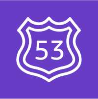
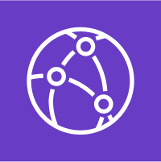
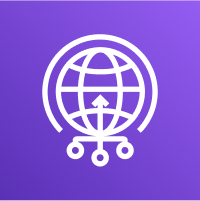

# AWS SAA C03 / Network

# Route53

AWS에서 제공하는 DNS(Domain Name System) 서비스.

- Authoritative DNS 서비스이다. (내가 직접 DNS 레코드를 업데이트 할 수 있음)

## Record Type

- A: hostname을 IPv4에 매핑 한다.

- AAAA: hostname을 IPv6에 매핑 한다.

- CNAME: hostname을 다른 hostname에 매핑 한다.

- NS: 도메인에 대한 트래픽이 어떻게 라우팅될지를 제어하는 서버의 집합이다.

- CNAME vs Alias:

  - CNAME: NON-ROOT domain에만 사용 가능. EC2에 사용 가능.

  - Alias: ROOT domain에도 사용 가능. 무료. native health check 제공. EC2는 Alias를 설정할 수 없다.

## Hosted Zone

Public Hosted Zone: 인터넷에서의 트래픽에 응답할 수 있다.

Private Hosted Zone: 하나 혹은 그 이상의 VPCs에서 온 요청에 응답할 수 있다.

# CloudFront

AWS의 Content Delivery Network(CDN) 서비스이다.

- 약 216개의 Edge Location이 있으며 컨텐츠가 Edge에서 캐싱된다.

- 컨텐츠가 세계적으로 분산되어 있기 때문에 DDoS에서 보호된다.

- Shield, AWS Application Firewall과 통합할 수 있다.

# Global Accelerator

전 세계에 분산된 AWS 엣지 위치를 활용하여 사용자의 트래픽을 최적의 경로로 안내하는 서비스.

- UDP 및 TCP 지원.

- Unicast 기반.

- 게임, IoT, 음성 통신과 같은 비 HTTP 기반 어플리케이션에 특히 유용.

- AWS 리소스에 대해 고정된 정적 IP 주소를 제공한다.

## CloudFront vs Global Accelerator

공통점:

- 글로벌 네트워크와 엣지 로케이션을 사용한다.

- DDoS 보호를 위해 AWS Shield와 통합된다.

차이점:

- CloudFront는 캐싱 기능 사용. Global Accelerator는 캐싱을 사용하지 않는다.
