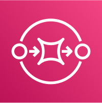
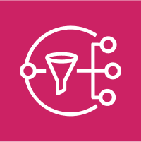
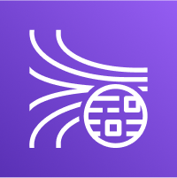
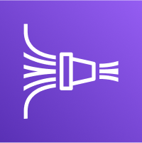
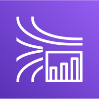
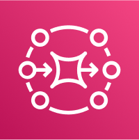

# AWS SAA C03 / Decoupling

# SQS

디커플링을 위한 완전 관리형 분산 메시지 큐 서비스.

- Producer와 Comsumer 사이의 Buffer 역할을 한다.

- 처리량 및 대기열 메시지 수 무제한.

## Producing & Consuming Messages

Producing:

- 중복된 메시지 및 순서가 잘못된 메시지가 있을 수 있다.

  - 중복: visibility timeout 늘리기 (메시지가 처리중일 때 다른 소비자에게 보이지 않도록 해서 중복 방지)

  - 순서: FIFO Queue

- 메시지는 소비자가 삭제할 때까지 SQS에서 유지된다. (기본 4일까지, 최대 14일까지)

- 메시지당 최대 256KB 크기 제한.

Consuming

- EC2 인스턴스, 서버, AWS Lambda 등에서 실행되며 SQS에서 메시지를 pulling한다. (한 번에 최대 10개)

- pulling -> 메시지 처리 -> 메시지 삭제 (DeleteMessage API이용)의 과정을 거친다.

- 소비자들은 메시지를 병렬로 받아 처리한다.

- 모든 메시지가 적어도 한 번은 소비자에게 전달되며, 중복으로 전달될 수도 있다. (At least once delivery)

- 최선을 다해 메시지를 순서대로 전달하지만, 완벽한 순서 보장은 되지 않는다. (Best-effort message ordering)

## Message Visibility Timeout

- 기본 Visibility Time === 30초

- Comsumer가 설정된 시간 내에 메시지를 처리하고 삭제하지 못하면 메시지는 다시 Visible이 되어 다른 소비자 혹은 동일 소비자에 의해 다시 처리될 수 있다.

- Visible Time 동안 메시지가 처리되지 않아 큐에 나타나면 중복 처리될 가능성이 있다.

- 소비자는 ChangeMessageVisibility API를 호출해서 처리 시간을 연장할 수 있다.

## Long Polling

큐에서 메시지를 요청할 때 큐에 메시지가 없다면 메시지가 도착할 때까지 대기할 수 있는 것. (메시지 검색 방법 최적화)

- 큐에서 메시지를 기다리는 과정을 최적화하는 방법이다.

- Long Polling은 SQS로의 API 호출 횟수를 줄이면서 어플리케이션의 효율성을 증가시키고 지연 시간을 감소시킨다.

- 대기 시간은 1초에서 20초 사이로 설정할 수 있으며, 일반적으로 20초가 권장된다.

- Long Polling은 Short Polling보다 선호되며, 더 효율적인 메시지 수신 방법을 제공한다.

- Long Polling은 큐 레벨에서 활성화할 수 있으며, 또는 WaitTimeSeconds 파라미터를 사용하여 API 호출 레벨에서 설정할 수 있다.

## FIFO Queue

메시지 순서가 보장되지만, 특정 시간 동안 큐로부터 보내거나 받을 수 있는 메시지의 수가 제한된다.

- Batch 없이 초당 300개의 메시지를 보내거나 받을 수 있다.

- Batch로 메시지를 보내거나 받을 때 초당 300개의 메시지를 보내거나 받을 수 있다.

- Batch: 여러 개의 작업을 모아서 한 번에 처리하는 것으로, SQS에서는 여러 개의 메시지를 모아서 한번에 SQS 대기열로 보내거나 받는 작업이다.

# SNS

푸시 알림, 이메일, SMS, HTTPS 등 다양한 메시지를 전송하는 완전관리형 알림 서비스.

Event Producing

- 메시지를 SQS 대기열로 직접 보낼 수 있다.

- Lambda에 데이터를 보내 처리할 수 있다.

- Kinesis Data Firehose로 데이터를 보내 S3나 Redshift로 보낼 수 있다.

Event Recieve

- CouldWatch, AWS Budget, ASG, CloudFormation, S3, RDS Event, Lambda 등에서 지정된 SNS 주제로 알림을 보낼 수 있다.

# Kinesis

로그, 지표, IoT 데이터 등을 실시간으로 스트리밍하여 데이터 수집, 처리, 분석하는 도구.

## Kinesis Data Streams

시스템에서 빅데이터를 스트림을 다루는 서비스.

- 1샤드 = 1MB/sec or 1000 msg/sec ⇒ 샤드가 많을 수록 빠른처리 가능

- Stream으로 구성되어 있고 1개의 Stream에는 여러개의 샤드가 있다.

- Kinesis로 Record가 전달 되는데 Record는 어떤 Shard로 분배될지를 정하는 Partition Key와 값인 Data Blob으로 구성된다.

- 데이터가 들어오면 삭제가 불가능하다.

- Producer: 어플리케이션, 서버 로그, IoT 기기, AWS 서비스 등.

- Consumer: 어플리케이션, EC2, Lambda, Kinesis Data Analytics, Kinesis Data Firehose 등.

## Kinesis Data Firehose

거의 모든 Data Producer에서 데이터를 가져올 수 있는 완전 관리 서비스.

- Lambda를 이용해서 데이터를 가공할 수 있다.

- 완전 관리 서비스로 데이터를 쓰는 코드를 작성할 필요가 없다.

- Destination으로는 다음이 있다.

  - AWS Destination: S3, Redshift, OpenSearch.

  - 3rd-party Partner Destination: Datadog, New Relic, MongoDB ...

  - Custom Destination: HTTP Endpoint

  - DynamoDB는 End Point에 없다

- 데이터가 지나간 만큼 비용 지불.

- '거의' 실시간임. (near real-time)

- 데이터 저장소가 없어 replay가 불가능하다.

## Kinesis Data Analytics

스트리밍 데이터를 분석하는 데 사용되는 완전 관리형 서비스.

# Amazon MQ

Rabbit MQ, Active MQ의 관리형 메시지 브로커 서비스.

- 다중 AZ에서 실행 가능하다.

- 큐, 토픽 기능이 있다.

- Active - Stand by로 가용성을 늘릴 수 있다.
