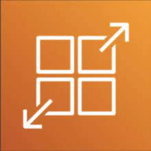
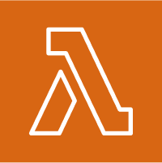

# AWS_SAA_C03(6) / Container & Serverless

## ECS

Elastic Container Service의 약자로 Docker 컨테이너를 간편하게 배포할 수 있는 AWS의 완전 관리형 서비스이다.

- ECS 클러스터에서 ECS 테스크를 실행하는 형태로 작동한다.

### ECS Cluster - EC2 Launch Type

- EC2 인스턴스 유형으로 ECS를 실행하면 EC2 인프라를 관리해야 한다.

- 각각의 EC2 인스턴스는 ECS Agent를 실행해야 한다.

### ECS Cluster - Fargate LaunchType

- EC2 인스턴스를 관리하지 않는 서버리스 서비스이다.

- ECS Task만 정의하면 필요한 CPU, RAM에 따라 자동으로 실행된다.

## ECR

Elastic Container Registry의 약자로 Docker 컨테이너 이미지를 저장, 관리, 배포하는 완전 관리형 서비스이다.

- S3를 기반으로 한다.

## EKS

Elastic Kubernetes Service의 약자로 AWS에서 제공하는 관리형 Kubernetes 클러스터 서비스이다.

- ECS와 유사하지만 다른 API를 사용한다. (오픈소스)

## Node Types

### Managed Node Groups

- 자동으로 EC2 인스턴스 노드를 생성한다.

- 노드는 EKS에 의해 관리되는 ASG의 일부이다.

- On-Demand or Spot Instances 지원

### Self-Managed Nodes

- 노드는 사용자에 의해 생성되고 EKS에 등록된다. 이후 ASG에 의해 관리된다.

- EKS에 최적화된 AMI를 미리 빌드할 수 있다.

- On-Demand or Spot Instances 지원

### AWS Fargate

- 노드를 관리하지 않는다.

## Data Volumes

- Container Storage Interface(CSI)를 준수하는 드라이버를 사용해야 한다.

- EKS에 StorageClass manifest를 확정해야 한다.

- EBS, EFS (works with Fargate), FSx for Lustre, FSx for NetApp ONTAP를 지원한다.

# App Runner

코드 저장소에서 앱 소스를 가져와 자동화된 빌드 및 배포 프로세스로 서버리스 어플리케이션을 배포할 수 있는 완전 관리형 서비스

- Docker 컨테이너 혹은 코드를 가지고 vCPU나 RAM, Auto Sacleing, Health Check 등의 설정을 하면 다음 작업은 자동으로 수행된다.

# Serverless in AWS

서버가 없는 것이 아니라 관리와 프로비전을 유저가 하지 않는 것을 말한다.

- Lambda

- API Gateway

- S3

- DynamoDB

- SNS

- SQS

- Kinesis Data Firehose

- Cognito

- Aurora Serverless

- Step Functions

- Fargate

# Lambda

가상의 함수로 AWS의 Faas서비스이다.

- 이벤트 기반 리소스.

- 호출을 받으면 온디맨드로 실행됨.

- 자동으로 스케일링 된다.

- 비동기 작업에 효율적이다.

## Lambda Limites

### Execution

- 128MB ~ 10GB 까지 메모리 제한이 있다.

- 15분(900초)의 시간제한이 있다.

- 디스크 용량 제한 512MB 에서 최대 10GB까지.

- 동시에 1000개까지 사용 가능. (예약을 통해 한도 늘릴 수 있다.)

- 환경 변수는 4KB까지 제한.

### Deployment

- 압축시 .zip파일로 50MB

- 압축 해제시 250MB

- 시작시 /tmp 파일을 다른 파일을 불러올 수 있다.

- 환경 변수는 4KB까지 제한.

## Lambda@edge

- Amazon CloudFront와 통합되어 작동하는 AWS Lambda의 기능.

- 사용자에게 더 가까운 위치에서 코드를 실행함으로써 응답 시간을 단축하고 사용자 경험을 개선할 수 있다.
