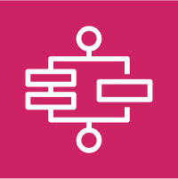
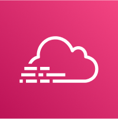
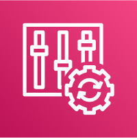
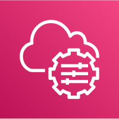

# AWS_SAA_C03(7) / Monitoring & Architect

# Step Functions

워크플로우를 시각적으로 구성할 수 있는 서버리스 형태의 기능. 주로 람다 함수를 오케스트레이션 하는 데 활용한다.

- EC2, ECS, On-premises, API Gateway, SQS 등과 연동할 수 있다.

# CloudWatch

AWS의 모든 서비스에 대한 지표를 제공하는 서비스.

- CPUUtilization, NetworkIn등을 모니터링 할 수 있다.

- 측정 항목에는 타임스탬프가 있다.

- 지표의 CloudWatch 대시보드를 생성할 수 있다.

- 대시보드 공유 기능을 통해 계정을 생성하지 않고 유저가 대시보드에 접근할 수 있다 (이후 유저 고유의 비밀번호 생성)

- Metric Streams: Amazon CloudWatch에서 생성된 메트릭을 실시간으로 다른 서비스로 전송할 수 있는 기능

# EventBridge

AWS의 다양한 이벤트에 대한 처리를 구성하는 서비스.

# CloudTrail

AWS 계정에 대한 governance, compliance, audit기능을 제공한다.

- AWS계정 내의 Console, SDK, CLI, AWS Services에 의한 이벤트, API콜 기록을 가져온다.

- 모든 리전 또는 단일 리전에 적용 가능하다.

- 90일 이상 보관하려면 CludWatch Logs나 S3에 보관해야 한다.

- S3에 오브젝트 레벨 활동(put, delete, get 등)은 기본적으로 기록하지 않지만 기록하도록 활성화 할 수 있다.

# Config

AWS 리소스의 규정 준수를 감사하고 기록하는 서비스.

- 보안 그룹 내의 SSH 액세스가 가능한지, 변경사항에 대한 알림이 가는지 등을 감사할 수 있다.

- 구체적인 구성 관리, 변경 추적, 규칙 위반 구성 변경 감지.

- 어떠한 행위를 하지 못하도록 막는 자체적 기능은 없다.

- Trigger와 Lambda를 통해서 적절하지 못한 설정을 감지하고 수정할 수 있다.

# Trusted Advisor

AWS 환경의 최적화를 돕는 서비스.

- 다양한 체크 및 필요에 다른 이메일 알림 설정.

- 광범위한 Best Practice 제시.

# AppFlow

소프트웨어-서비스(SaaS) 애플리케이션과 AWS 서비스 간에 데이터를 손쉽게 전송할 수 있도록 해주는 완전 관리형 통합 서비스.

- 예를 들어 Salesforce, Slack, DataDog 등을 SaaS 데이터 소스로 사용할 수 있다.

- 코드를 작성하지 않고도 데이터를 안전하게 이동시킬 수 있다.

- 복잡한 데이터 변환 또는 데이터 전송 작업을 자동화할 수 있다.

- 여러개의 SaaS와 연동할 수 있다.

# Systems Manager

AWS의 리소스 및 온프레미스 서버의 자동, 수동 작업을 관리한다.

- Automation action: 여러 AWS 서비스에 걸쳐 일상적 운영 작업을 자동화 할 수 있게 지원한다.

  - ex) 패치 관리, 소프트웨어 설치.

- Run command: 관리 대상 인스턴스에 대한 작업을 수행한다.

  - ex) 임의의 셸 스크립트 실행.

- Session manager: 시큐리티 그룹, 인바운드 포트 개방 등을 하지 않아도 셸 접속을 지원.

- Patch manager: Linux 및 Windows 인스턴스 패치 업무의 자동화.

- State manager: 사용자 정의 방식대로 소프트웨어를 가져오고 환경을 설정한다.

- Insight: AWS 리소스 그룹에 따라 카테고리. 태그 키와 태그 밸류를 이용해서 리소스 그룹을 정의한다.

- Inventory manager: OS, 어플레이션 버전 등 인스턴스의 데이터 수집.

- Compliance: 사용자 규정 환경 설정이 인스턴스의 패치 및 상태 관리에 적용되고 있는지 보여줌.
