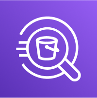

# AWS_SAA_C03(8) / Analytics

# Athena

S3에 저장된 데이터를 분석하는 서버리스 쿼리 서비스.

- SQL 언어를 사용하여 파일을 쿼리한다. (Presto 기반)

- CSV, JSON, ORC, Avro 및 Parquet 지원.

# Redshift

PostgreSQL을 기반으로 하는 OLAP(Online Analytical Processing).

- 대형 데이터 셋을 분석할 수 있는 데이터 웨어하우스이다.

- OLTP 아님.

- Columnar storage이다. (row base아님)

- SQL 기반이다.

## Redshift Cluster

- Leader node: 쿼리 계획, 결과 집계 용도.

- Compute node: 쿼리를 수행하기 위해 결과를 리더 노드에게 보낸다.

- 노드의 크기를 미리 프로비저닝 한다.

# OpenSearch

분산형 검색 및 분석 엔진 서비스.

- Elasticsearch와의 호환성 제공Elasticsearch와의 호환성을 제공한다.

- 모든 필드, 부분 일치 항목 등을 검색할 수 있다.

- 기본적으로 SQL 미지원, 플러그인을 통한 활성화 가능.

- OpenSearch 대시보드와 함께 제공.

# EMR

Elastic Map Reduce의 약자로 완전 관리형 Hadoop cluster이다.

- 빅데이터 처리에 적합하다.

- Apache Spark, HBase, Presto, Flink등과 함께 제공되며, 프로비저닝과 관리를 지원한다.

# QuickSight

서버리스 머신러닝 기반 비즈니스 분석 시각화 도구.

- RDS, Athena, Redshift, S3 등 다양한 데이터 소스와 통합할 수 있다.

- 데이터를 직접 QuickSight로 넣을때 SPICE 엔진을 사용하여 in-memory 연산을 한다.

- Enterprise 버전에서는 Column-Level security(CLS)를 설정할 수 있다.

# Glue

서버리스 관리형 extract, transform, and load(ETL)서비스.

- 분석을 위한 데이터를 준비하고 변환하는 데 매우 유용한다.

- 데이터를 Parquet 포멧으로 변경할 수 있다.

- Glue Data Catalog는 Glue Data Crawler를 이용해서 S3, RDS, DynamoDB 등의 데이터를 크롤링 하고 ETL 작업에 사용될 메타데이터를 추출한다.

- Athena, Redshift Spectrum, EMR 등이 데이터를 검색할 때 Glue Data Catalog를 이용한다.

- Glue Job Bookmarks: 새 ETL 작업을 실행할 때 이전 데이터의 재처리를 방지한다.
