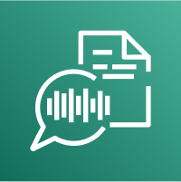
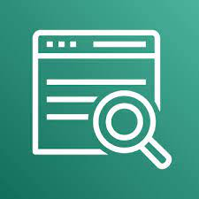

# AWS_SAA_C03(8) / Machine Learning

# Rekognition

이미지 및 비디오에서 객체, 얼굴, 텍스트 등을 찾는다.

- 부적절하거나 공격적인 콘텐츠를 감지할 수 있다.

# Transcribe

오디오 및 비디오에서 자동으로 음성을 텍스트로 변환한다.

- 자동 음성 인식(ASR)이라는 딥 러닝 프로세스를 사용한다.

# Polly

텍스트를 음성으로 변환한다.

# Translate

텍스트 번역 서비스.

# Lex

자동 음성 인식을 통해 음성을 텍스트로 변환. 챗봇 구축 지원.

# Connect

전화를 수신하고 고객 응대 흐름을 생성하는 클라우드 기반 가상 고객센터.

# Comprehend

텍스트 분석 서비스. 감정 분석, 핵심 문구 추출등을 할 수 있다.

- Natural Language Processing (NLP) / 자연어 처리

- Comprehend Medical 서비스를 통해 임상 텍스트에서 유용한 정보를 수집할 수 있다.

# SageMaker

머신러닝 모뎅을 쉽게 구축하고 운영할 수 있도록 하는 서비스.

# Forecast

머신러닝을 사용하여 매우 정확한 예측을 제공하는 완전 관리형 서비스.

# Kendra

머신러닝 기반 완전 관리형 문서 검색 서비스.

- 문서 내에서 답변을 추출한다.

- 자연어 검색 기능을 지원한다.

- 사용자와 상호작용(피드백)을 통해 학습 가능.

# Personalize

실시간 맞춤 추천 서비스를 구축하기 위한 완전 관리형 머신러닝 서비스.

# Textract

이미지 또는 PDF 파일에서 텍스트와 데이터를 추출하는 서비스.
